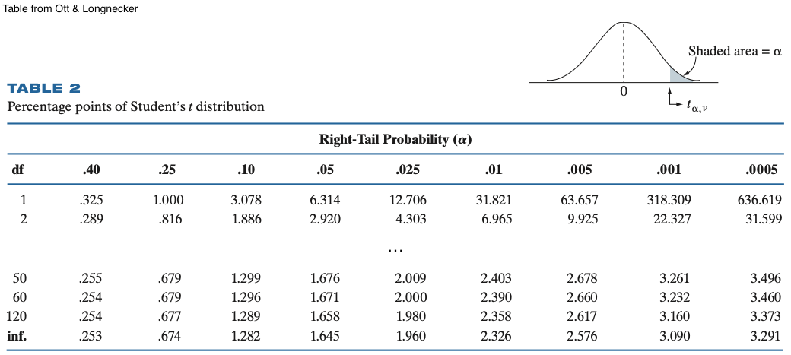

## Introduction 

```{r setup}
#| echo: false
library(tidyverse)

uwf_blue <- "#004C97"
uwf_green <- "#007A33"
uwf_marigold <- "#FFB81C"
uwf_midnight <- "#003865"
```

- We covered the ground rules: 

    - probabilities are between 0 and 1, and 
    
    - all outcomes sum to 1.

- We covered probability basics: 

    - complement
    
    - independence
    
    - conditional probability
    
- Now, we zoom out: instead of asking about *one* event at a time, we'll describe probability for any possible event.


## Probability Distributions

- Recall from last lecture: a random experiment has a sample space, or the set of everything that could happen

::: {.notebook-entry}
::: {.notebook-tab}
Probability distribution
:::
- A **probability distribution** assigns a probability to *every* outcome in that sample space
:::

- Two requirements:
  - Every probability is between 0 and 1
  - All the probabilities together add up to 1

## Discrete Variables

Before we can describe a variable's distribution, we have to know what *kind* of variable it is.

::: {.notebook-entry}
::: {.notebook-tab}
Discrete variables
:::
Outcomes that can be enumerated. 

- Counts: how many? 0, 1, 2, ...
- Categories: ordinal or nominal
- Binary: yes/no, true/false, 0/1, etc.
:::

## Example: Discrete Variables

- Example: the ZPD role of each recruit

```{r}
#| echo: false
#| fig-align: 'center'

dept_probs <- tibble(
  department = c("Patrol", "Desk"),
  probability = c(0.72, 0.28)
)

ggplot(dept_probs, aes(x = department, y = probability, fill = department)) +
  geom_col(width = 0.5) +
  geom_text(aes(label = scales::percent(probability)), vjust = -0.5, size = 6) +
  scale_fill_manual(values = c("Patrol" = uwf_green, "Desk" = uwf_blue)) +
  scale_y_continuous(limits = c(0, 1), labels = scales::percent) +
  labs(x = NULL, y = "Probability", title = NULL) +
  theme_minimal(base_size = 20) +
  theme(legend.position = "none")
```

## Example: Discrete Variables

- Example: recruits' exam score categorization

```{r}
#| echo: false
#| fig-align: 'center'

perf_probs <- tibble(
  performance_tier = factor(
    c("Needs Improvement", "Satisfactory", "Proficient", "Exceptional"),
    levels = c("Needs Improvement", "Satisfactory", "Proficient", "Exceptional")
  ),
  probability = c(0.10, 0.35, 0.40, 0.15)
)

ggplot(perf_probs, aes(x = performance_tier, y = probability, fill = performance_tier)) +
  geom_col(width = 0.5) +
  geom_text(aes(label = scales::percent(probability)), vjust = -0.5, size = 6) +
  scale_fill_manual(values = c(
    "Needs Improvement" = uwf_marigold,
    "Satisfactory" = uwf_green,
    "Proficient" = uwf_blue,
    "Exceptional" = uwf_midnight
  )) +
  scale_y_continuous(limits = c(0, 1), labels = scales::percent) +
  labs(x = NULL, y = "Probability", title = NULL) +
  theme_minimal(base_size = 20) +
  theme(legend.position = "none",
        axis.text.x = element_text(angle = 20, hjust = 1))
```

## Continuous Variables

Before we can describe a variable's distribution, we have to know what *kind* of variable it is.

::: {.notebook-entry}
::: {.notebook-tab}
Continuous variables
:::
Outcomes that cannot be enumerated. 

- These are things we measure and could fall anywhere on a scale.
:::

## Example: Continuous Variables

- Example: recruits' exam score

```{r}
#| echo: false
#| fig-align: 'center'
set.seed(15671)

exam_df <- tibble(
  academy_exam_score = rnorm(500, mean = 72, sd = 8)
)

ggplot(exam_df, aes(x = academy_exam_score)) +
  geom_histogram(binwidth = 4, fill = uwf_blue, color = "white") +
  labs(x = "Academy Exam Score", y = "Count", title = NULL) +
  theme_minimal(base_size = 20)
```

## Example: Continuous Variables

- Example: side hustle earnings

```{r}
#| echo: false
#| fig-align: 'center'
set.seed(797)

earnings_df <- tibble(
  hustle_earnings = rgamma(300, shape = 2, scale = 25)
)

ggplot(earnings_df, aes(x = hustle_earnings)) +
  geom_histogram(binwidth = 20, fill = uwf_blue, color = "white") +
  labs(x = "Hustle Earnings", y = "Count", title = NULL) +
  theme_minimal(base_size = 20)
```

## Probability Mass Function (PMF)

- We can formally describe the probability using a function.

::: {.notebook-entry}
::: {.notebook-tab}
Probability mass function (PMF)
:::

For a discrete variable, the rule that assigns a probability to each possible value is called the **probability mass function (PMF)**.
:::

- i.e., the PMF is just the bar chart in function form. 

    - Pick any value of the variable and the PMF tells you the corresponding probability.

## Probability Density Function (PDF)

- We can formally describe the probability using a function.

::: {.notebook-entry}
::: {.notebook-tab}
Probability density function (PDF)
:::

For a continuous variable, the rule that describes the probability a range of possible value is called the **probability density function (PDF)**.
:::

- i.e., the PDF is just the density plot in function form. However,

    - The curve itself is *not* a probability -- we must find the probability by calculating the area under the curve for a range of values.
    
    - The *total* area under the whole curve is 1

## Cumulative Distribution Function (CDF)

Both discrete and continuous variables share the cumulative distribution function (CDF).

::: {.notebook-entry}
::: {.notebook-tab}
Cumulative density function (CDF)
:::

For either type of variable, the rule that gives the probability of being at or below a specific value is called the **cumulative distribution function (CDF)**.
:::

- The CDF is a running total as you move left to right -- it is the cumulative probability

## PMF vs CDF

- Comparing the PMF of ZPD assignment to the CMF:

```{r cdf-comparison}
#| fig-align: 'center'
#| echo: false
set.seed(7067)

dept_probs <- tibble(
  department = c("Patrol", "Desk"),
  probability = c(0.72, 0.28)
)

disc_cdf <- tibble(
  x = c(0, 1, 2, 3),
  cumulative = c(0, 0.28, 1.00, 1.00)
)

p1 <- ggplot(dept_probs, aes(x = department, y = probability, fill = department)) +
  geom_col(width = 0.5) +
  scale_fill_manual(values = c("Patrol" = uwf_green, "Desk" = uwf_green)) +
  scale_y_continuous(limits = c(0, 1)) +
  labs(title = "PMF", x = NULL, y = "Probability") +
  theme_minimal(base_size = 20) +
  theme(legend.position = "none")

p2 <- ggplot(disc_cdf, aes(x = x, y = cumulative)) +
  geom_step(color = uwf_green, linewidth = 1.2, direction = "hv") +
  #geom_point(data = disc_cdf |> filter(x %in% c(1, 2)), color = uwf_green, size = 3) +
  scale_x_continuous(breaks = c(1, 2), labels = c("Desk", "Patrol"), limits = c(0, 3)) +
  scale_y_continuous(limits = c(0, 1)) +
  labs(title = "CDF", x = NULL, y = "Cumulative Probability") +
  theme_minimal(base_size = 20)

ggpubr::ggarrange(p1, p2, ncol = 2)
```

## PDF vs CDF

- Comparing the PDF of academy exam scores to the CDF:

```{r}
#| fig-align: 'center'
#| echo: false
set.seed(7067)

cont_df <- tibble(x = seq(30, 115, length.out = 300)) |>
  mutate(density = dnorm(x, mean = 72, sd = 8),
         cumulative = pnorm(x, mean = 72, sd = 8))

p3 <- ggplot(cont_df, aes(x = x, y = density)) +
  geom_line(color = uwf_blue, linewidth = 1.2) +
  labs(title = "PDF", x = "Score", y = "Density") +
  theme_minimal(base_size = 20)

p4 <- ggplot(cont_df, aes(x = x, y = cumulative)) +
  geom_line(color = uwf_blue, linewidth = 1.2) +
  scale_y_continuous(limits = c(0, 1)) +
  labs(title = "CDF", x = "Score", y = "Cumulative Probability") +
  theme_minimal(base_size = 20)

ggpubr::ggarrange(p3, p4, ncol = 2)
```

## Binomial Experiments

- Deputy Chief Okonkwo wants to know: 

    - *"If I pull $n$ recruits at random, how many will be Patrol?"*
    
- This is a **binomial experiment**:

    1. The experiment consists of $n$ identical trials (pulling $n$ recruits at random).
    2. Each trial has two possible outcomes: "success" (Patrol) or "failure" (Desk).
    3. The probability of success ($\pi$) is the same for each trial (0.72).
    4. The trials are independent (the duty assignment of one recruit does not affect the duty assignment of another).
    5. The random variable $y$ is the number of successes (recruits on Patrol) in $n$ trials.
    
## The Binomial Distribution    

- We use the binomial distribution to describe the probabilities of binomial experiments,

::: {.notebook-entry}
::: {.notebook-tab}
Binomial Distribution
:::
For a fixed number of independent binary trials, the distribution that describes the probability of a specific number of "successes" is called the **binomial distribution**.
:::

- If $y$ has a binomial distribution, we say $y \sim Bin(n, \pi)$.

## The Binomial Distribution

- The probability of observing $y$ successes in $n$ trials of a binomial experiment is given by

$$
P(y) = \frac{n!}{y!(n-y)!} \pi^y (1-\pi)^{n-y}
$$

  - $n$ = number of trials,
  - $y$ = number of successes,
  - $\pi$ = probability of success on a single trial

## The Binomial Distribution

- Deputy Chief Okonkwo wants to know: 

    - *"If I pull $n$ recruits at random, how many will be Patrol?"*

- This question asks us to count the number of "successes" (e.g., Patrol) out of a fixed number of tries

- The binomial distribution is appropriate here, as:

    - $n$ (number of recruits in sample)
    - $y$ (number of recruits in sample that are Patrol)
    - $\pi$ (probability of an individual being Patrol)

## The Binomial Distribution

- The shape of the binomial distribution depends on $n$ and $p$.

```{r binomial-shapes}
#| fig-align: 'center'
#| echo: false
set.seed(111)

binom_df <- bind_rows(
  tibble(x = 0:30, prob = dbinom(x, size = 30, prob = 0.72), p_label = "n = 30, p = 0.72"),
  tibble(x = 0:10, prob = dbinom(x, size = 10, prob = 0.5), p_label = "n = 10, p = 0.50")
)

ggplot(binom_df, aes(x = x, y = prob)) +
  geom_col(fill = uwf_blue) +
  facet_wrap(~p_label, scales = "free_x") +
  labs(x = "Number of Successes", y = "Probability", title = NULL) +
  theme_minimal(base_size = 20)
```

- If we have more recruits or a different success rate, our expectations change.

## The Normal Distribution

- Deputy Chief Okonkwo wants to know:
    - *"How are academy exam scores distributed across all recruits?"*

- The **normal distribution** is the right tool when:
    1. The random variable is continuous (exam scores can take any value along a scale).
    2. The distribution is symmetric, with values clustering around a central average.
    3. Values far from the average become progressively less likely, tapering off evenly in both directions.

## The Normal Distribution

- We use the normal distribution to describe continuous variables that cluster symmetrically around an average,

::: {.notebook-entry}
::: {.notebook-tab}
Normal Distribution
:::
For a continuous variable that clusters symmetrically around an average, the distribution that describes the probability of a range of values is called the **normal distribution**.
:::

- If $y$ has a normal distribution, we say $y \sim N(\mu, \sigma)$.

## The Normal Distribution

- The probability density of a normal distribution at a value $y$ is given by

$$
f(y) = \frac{1}{\sigma\sqrt{2\pi}} e^{-\frac{1}{2}\left(\frac{y - \mu}{\sigma}\right)^2}
$$

  - $\mu$ = population mean,
  - $\sigma$ = population standard deviation,
  - $y$ = a possible value of the variable

## The Normal Distribution

- Deputy Chief Okonkwo wants to know:
    - *"How are academy exam scores distributed across all recruits?"*

- This question asks us to describe the pattern of a continuous variable around its average

- The normal distribution is appropriate here, with:
    - $\mu$ (average academy exam score across recruits)
    - $\sigma$ (spread of academy exam scores around that average)
    - $y$ (a recruit's individual exam score)

## The Normal Distribution

- The shape of the normal distribution depends on $\mu$ and $\sigma$.

```{r normal-shapes}
#| fig-align: 'center'
#| echo: false
set.seed(111)

normal_df <- bind_rows(
  tibble(x = seq(40, 100, length.out = 300)) |> mutate(density = dnorm(x, 72, 8), p_label = "mean = 72, sd = 8"),
  tibble(x = seq(40, 100, length.out = 300)) |> mutate(density = dnorm(x, 72, 4), p_label = "mean = 72, sd = 4")
)

ggplot(normal_df, aes(x = x, y = density)) +
  geom_line(color = uwf_blue, linewidth = 1.2) +
  #geom_area(fill = uwf_blue, alpha = 0.15) +
  facet_wrap(~p_label, scales = "free_x") +
  labs(x = "Score", y = "Density", title = NULL) +
  theme_minimal(base_size = 20)
```

- Note that $\mu$ controls the *location* and $\sigma$ controls the *shape*.

## The Normal Distribution

- When we change $\mu$,

```{r}
#| fig-align: 'center'
#| echo: false
set.seed(176927)

mu_df <- bind_rows(
  tibble(x = seq(40, 110, length.out = 300)) |> mutate(density = dnorm(x, 60, 8), label = "mu = 60"),
  tibble(x = seq(40, 110, length.out = 300)) |> mutate(density = dnorm(x, 72, 8), label = "mu = 72"),
  tibble(x = seq(40, 110, length.out = 300)) |> mutate(density = dnorm(x, 90, 8), label = "mu = 90")
)

ggplot(mu_df, aes(x = x, y = density, color = label)) +
  geom_line(linewidth = 1.2) +
  scale_color_manual(values = c(uwf_blue, uwf_green, uwf_marigold)) +
  labs(x = "Score", y = "Density", color = NULL, title = NULL) +
  theme_minimal(base_size = 20) +
  theme(legend.position = "bottom")
```

## The Normal Distribution

- When we change $\sigma$,

```{r}
#| fig-align: 'center'
#| echo: false
set.seed(798765)

sigma_df <- bind_rows(
  tibble(x = seq(40, 100, length.out = 300)) |> mutate(density = dnorm(x, 72, 4), label = "sigma = 4"),
  tibble(x = seq(40, 100, length.out = 300)) |> mutate(density = dnorm(x, 72, 8), label = "sigma = 8"),
  tibble(x = seq(40, 100, length.out = 300)) |> mutate(density = dnorm(x, 72, 12), label = "sigma = 12")
)

ggplot(sigma_df, aes(x = x, y = density, color = label)) +
  geom_line(linewidth = 1.2) +
  scale_color_manual(values = c(uwf_blue, uwf_green, uwf_marigold)) +
  labs(x = "Score", y = "Density", color = NULL, title = NULL) +
  theme_minimal(base_size = 20) +
  theme(legend.position = "bottom")
```

## The Normal Distribution

- Finally, we have the standard normal, where $z \sim N(0, 1)$.

```{r}
#| fig-align: 'center'
#| echo: false
set.seed(79276777)

std_normal_df <- tibble(x = seq(-4, 4, length.out = 300)) |>
  mutate(density = dnorm(x, mean = 0, sd = 1))

ggplot(std_normal_df, aes(x = x, y = density)) +
  geom_line(color = uwf_blue, linewidth = 1.2) +
  labs(x = "z", y = "Density", title = NULL) +
  theme_minimal(base_size = 20)
```

## The $t$-Distribution

- Deputy Chief Okonkwo wants to know:

    - *"Sahara Square only has 8 recruits — how confident can we be about their average sleep hours?"*

- The **t-distribution** is the right tool when:
    1. The random variable is continuous (sleep hours can take "any" value).
    2. The sample size is small ("small" meaning $n < 30$).
    3. The population standard deviation ($\sigma$) is unknown, so we estimate it with the sample standard deviation ($s$).
    
- We will see that estimating $\sigma$ with $s$ adds uncertainty.

    - The $t$-distribution has heavier tails than the normal.

## The $t$-Distribution

- We use the $t$-distribution to describe a continuous variable estimated from a small sample with unknown population spread,

::: {.notebook-entry}
::: {.notebook-tab}
$t$-Distribution
:::
For a continuous variable estimated from a small sample with unknown population standard deviation, the distribution that describes the probability of a range of values is called the **t-distribution**.
:::

## The $t$-Distribution

- The probability density of a t-distribution at a value $y$ is given by

$$
f(y) = \frac{\Gamma\left(\frac{\nu+1}{2}\right)}{\sqrt{\nu\pi}\,\Gamma\left(\frac{\nu}{2}\right)} \left(1 + \frac{y^2}{\nu}\right)^{-\frac{\nu+1}{2}}
$$
  - $\nu$ = degrees of freedom

## The $t$-Distribution

- Deputy Chief Okonkwo wants to know:

    - *"Sahara Square only has 8 recruits — how confident can we be about their average sleep hours?"*

- This question asks us to estimate a population average from a *small sample* where we don't know the true population spread

- The $t$-distribution is appropriate here, with:
    - $n$ (number of recruits in the Sahara Square sample: 8)
    - $s$ (*sample* standard deviation of sleep hours)
    - $\nu$ (degrees of freedom = $n - 1 = 7$ in this case)

## The $t$-Distribution

- The shape of the $t$-distribution depends on its degrees of freedom ($\nu$). 

```{r t-shapes}
#| fig-align: 'center'
#| echo: false
set.seed(7916698)

t_df <- bind_rows(
  tibble(x = seq(-4, 4, length.out = 300)) |> mutate(density = dt(x, df = 2), label = "df = 2"),
  tibble(x = seq(-4, 4, length.out = 300)) |> mutate(density = dt(x, df = 7), label = "df = 7"),
  tibble(x = seq(-4, 4, length.out = 300)) |> mutate(density = dnorm(x), label = "standard normal")
)

ggplot(t_df, aes(x = x, y = density, color = label)) +
  geom_line(linewidth = 1.2) +
  scale_color_manual(values = c(uwf_blue, uwf_green, uwf_marigold)) +
  labs(x = "t", y = "Density", color = NULL, title = NULL) +
  theme_minimal(base_size = 20) +
  theme(legend.position = "bottom")
```

- As $\nu$ grows larger (more data), the $t$-distribution's tails shrink and it converges toward the standard normal.

## The $t$-Distribution

{fig-align="center"}

- **Recall**: learning probabilities using tables in a book

    - When you hit a "large enough" sample size, it goes to df = $\infty$ and the resulting values are the same as the standard normal.
    
    - That is because the $t$-distribution converges to the standard normal as $\nu \to \infty$.

## The $\chi^2$-Distribution

- Deputy Chief Okonkwo wants to know:

    - *"ZPD claims academy exam scores have a standard deviation of 10 — is our recruits' spread consistent with that?"*
    
- The **chi-squared distribution** will be used in hypothesis testing, not for describing the shape of a variable itself.

    - We use it strictly as a *tool for hypothesis testing*.
    
    - We will see it across several topics, including one-sample tests for variance, two-sample tests for variance, and goodness-of-fit tests.

## The $\chi^2$-Distribution

- We use the $\chi^2$-distribution to describe how sample variance behaves when testing a claim about population spread,

::: {.notebook-entry}
::: {.notebook-tab}
$\chi^2$-Distribution
:::
For a quantity built from squared, standardized sample variance, the distribution that describes the probability of a range of values is called the **chi-squared distribution**.
:::

## The $\chi^2$-Distribution

- The probability density of a chi-squared distribution at a value $y$ is given by

$$
f(y) = \frac{1}{2^{\nu/2}\Gamma\left(\frac{\nu}{2}\right)} y^{\frac{\nu}{2}-1} e^{-y/2}, \quad y \geq 0
$$
  - $\nu$ = degrees of freedom

## The $\chi^2$-Distribution

- The shape of the $\chi^2$-distribution depends on its degrees of freedom ($\nu$).

```{r chisq-shapes}
#| fig-align: 'center'
#| echo: false
set.seed(7916698)

chisq_df <- bind_rows(
  tibble(x = seq(0, 20, length.out = 300)) |> mutate(density = dchisq(x, df = 2), label = "df = 2"),
  tibble(x = seq(0, 20, length.out = 300)) |> mutate(density = dchisq(x, df = 5), label = "df = 4")
)

ggplot(chisq_df, aes(x = x, y = density, color = label)) +
  geom_line(linewidth = 1.2) +
  scale_color_manual(values = c(uwf_blue, uwf_green)) +
  labs(x = expression(chi^2), y = "Density", color = NULL, title = NULL) +
  theme_minimal(base_size = 20) +
  theme(legend.position = "bottom")
```

## The $\chi^2$-Distribution

- Unlike the $t$-distribution, the $\chi^2$-distribution is not symmetric. 
    - As $\nu$ grows larger, it becomes more symmetric and bell-shaped.

```{r}
#| fig-align: 'center'
#| echo: false
set.seed(7916698)

chisq_df <- bind_rows(
  tibble(x = seq(0, 60, length.out = 300)) |> mutate(density = dchisq(x, df = 3), label = "df = 3"),
  tibble(x = seq(0, 60, length.out = 300)) |> mutate(density = dchisq(x, df = 15), label = "df = 15"),
  tibble(x = seq(0, 60, length.out = 300)) |> mutate(density = dchisq(x, df = 30), label = "df = 30")
) |>
  mutate(label = factor(label, levels = c("df = 3", "df = 15", "df = 30")))

ggplot(chisq_df, aes(x = x, y = density, color = label)) +
  geom_line(linewidth = 1.2) +
  scale_color_manual(values = c(uwf_blue, uwf_green, uwf_marigold)) +
  labs(x = expression(chi^2), y = "Density", color = NULL, title = NULL) +
  theme_minimal(base_size = 20) +
  theme(legend.position = "bottom")
```

## The $F$-Distribution

- We use the $F$-distribution to describe how the ratio of two sample variances behaves when comparing spread across two groups,

::: {.notebook-entry}
::: {.notebook-tab}
$F$-Distribution
:::
For a quantity built from the ratio of two independent $\chi^2$ variables, the distribution that describes the probability of a range of values is called the **F-distribution**.
:::

## The $F$-Distribution

- The probability density of an $F$-distribution at a value $y$ is given by

$$
f(y) = \frac{\sqrt{\frac{(\nu_1 y)^{\nu_1} \nu_2^{\nu_2}}{(\nu_1 y + \nu_2)^{\nu_1+\nu_2}}}}{y \, \text{B}\left(\frac{\nu_1}{2}, \frac{\nu_2}{2}\right)}, \quad y \geq 0
$$

  - $\nu_1$ = degrees of freedom, numerator
  - $\nu_2$ = degrees of freedom, denominator

## The $F$-Distribution

- The shape of the $F$-distribution depends on **two** degrees of freedom, $\nu_1$ and $\nu_2$.

```{r f-shapes}
#| fig-align: 'center'
#| echo: false
set.seed(7916698)

f_df <- bind_rows(
  tibble(x = seq(0, 5, length.out = 300)) |> mutate(density = df(x, df1 = 2, df2 = 5), label = "df1 = 2, df2 = 5"),
  tibble(x = seq(0, 5, length.out = 300)) |> mutate(density = df(x, df1 = 5, df2 = 15), label = "df1 = 5, df2 = 15")
)

ggplot(f_df, aes(x = x, y = density, color = label)) +
  geom_line(linewidth = 1.2) +
  scale_color_manual(values = c(uwf_blue, uwf_green)) +
  labs(x = "F", y = "Density", color = NULL, title = NULL) +
  theme_minimal(base_size = 20) +
  theme(legend.position = "bottom")
```

## The $F$-Distribution
- Like the $\chi^2$-distribution, the $F$-distribution is not symmetric and only takes non-negative values.

    - As $\nu_1$ and $\nu_2$ grow larger, it becomes more symmetric and bell-shaped.
    
```{r f-shapes-2}
#| fig-align: 'center'
#| echo: false
set.seed(7916698)

f_df <- bind_rows(
  tibble(x = seq(0, 5, length.out = 300)) |> mutate(density = df(x, df1 = 2, df2 = 5), label = "df1 = 2, df2 = 5"),
  tibble(x = seq(0, 5, length.out = 300)) |> mutate(density = df(x, df1 = 10, df2 = 20), label = "df1 = 10, df2 = 20"),
  tibble(x = seq(0, 5, length.out = 300)) |> mutate(density = df(x, df1 = 30, df2 = 40), label = "df1 = 30, df2 = 40")
) |>
  mutate(label = factor(label, levels = c("df1 = 2, df2 = 5", "df1 = 10, df2 = 20", "df1 = 30, df2 = 40")))

ggplot(f_df, aes(x = x, y = density, color = label)) +
  geom_line(linewidth = 1.2) +
  scale_color_manual(values = c(uwf_blue, uwf_green, uwf_marigold)) +
  labs(x = "F", y = "Density", color = NULL, title = NULL) +
  theme_minimal(base_size = 20) +
  theme(legend.position = "bottom")
```


## Wrap Up

This lecture gave an overview of probability functions:

1. **PMF:** probability mass function; for discrete variables.
    
2. **PDF:** probability density function; for continuous variables.
    
3. **CDF:** cumulative distribution function; for discrete and continuous variables

and distributions:  

1. **Binomial:** for counting successes in a fixed number of independent trials.
    
2. **Normal:** for continuous variables that cluster symmetrically around an average.
    
3. **t:** for continuous variables estimated from a small sample with unknown population standard deviation.
    
4. **Chi-squared:** (hypothesis testing)
    
5. **F:** (hypothesis testing)

## Looking Forward

- In the next module, you will use these concepts to answer questions such as:

    - "ZPD claims their exam scores have a standard deviation of 10. You have real data. Is that claim believable?"

- We will continue to see these distributions when learning various hypothesis tests.

- Before we learn hypothesis testing, we will learn how to estimate population parameters from sample statistics.

    - Our next lectures cover data description using point estimation and graphical methods.